# Frontend

This is the frontend section of my end of studies project, wich is a trainee recruitement platform that allows candidates to apply for internships provided by the company "proxym" and allow the hiring team to manage the applications

# Run the server

1. Install dependencies

   `yarn`

2. Modify the .env.dev file to your needs

3. Run the backend server, you can find it here [Backend server](https://github.com/aminezouari52/proxym-trainee-recruitment-backend)

4. Run the frontend server

   `yarn start:dev`

# Platform screenshots

## Visitor

### On Boarding

### Login

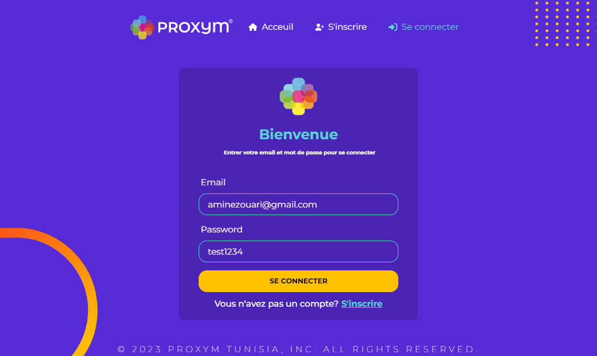

### Sign up

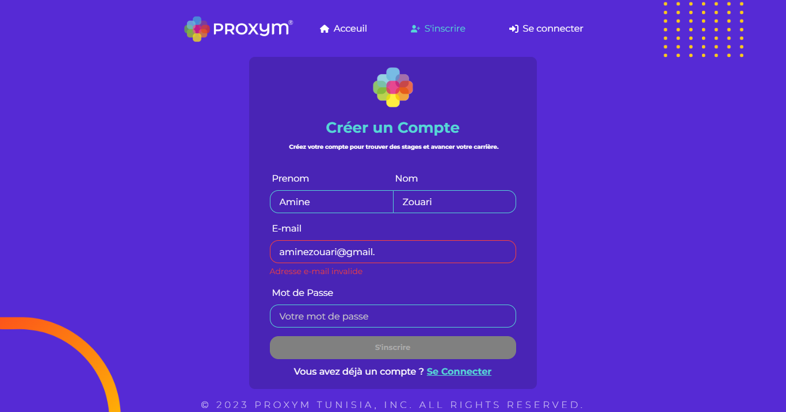

## Candidate

### Home Page

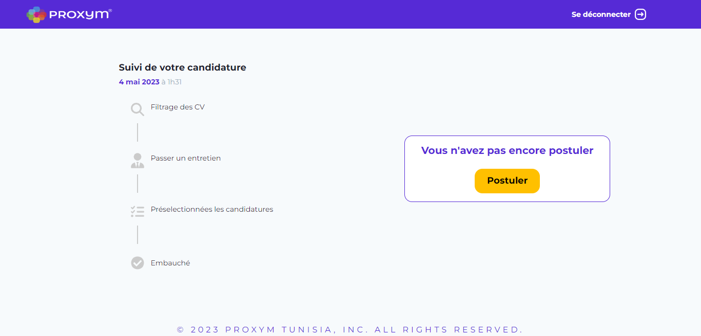
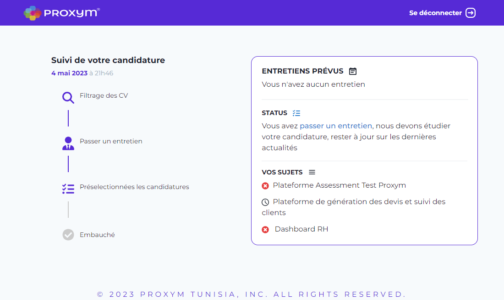

### Application Form

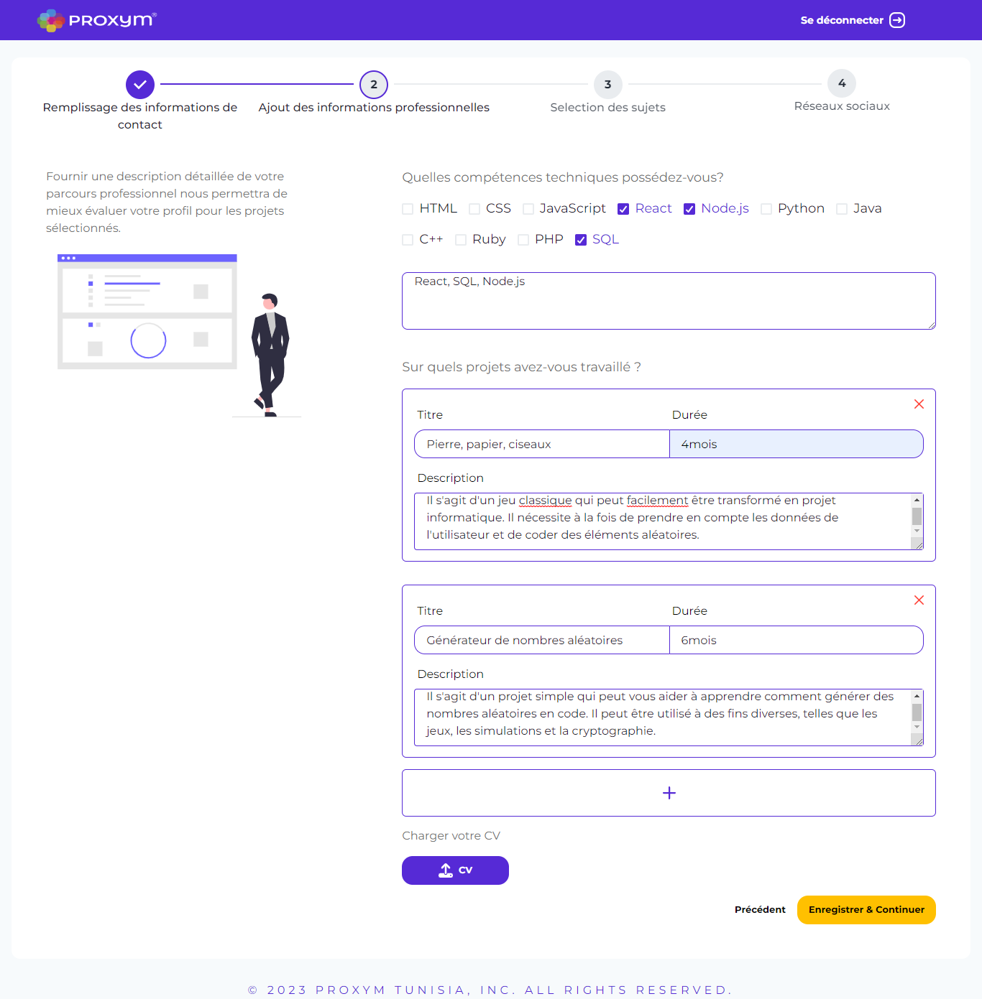
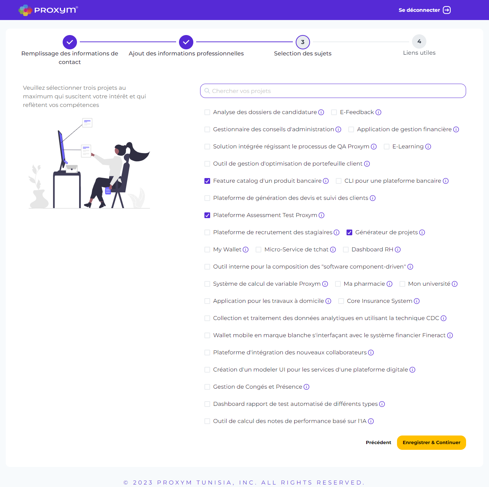
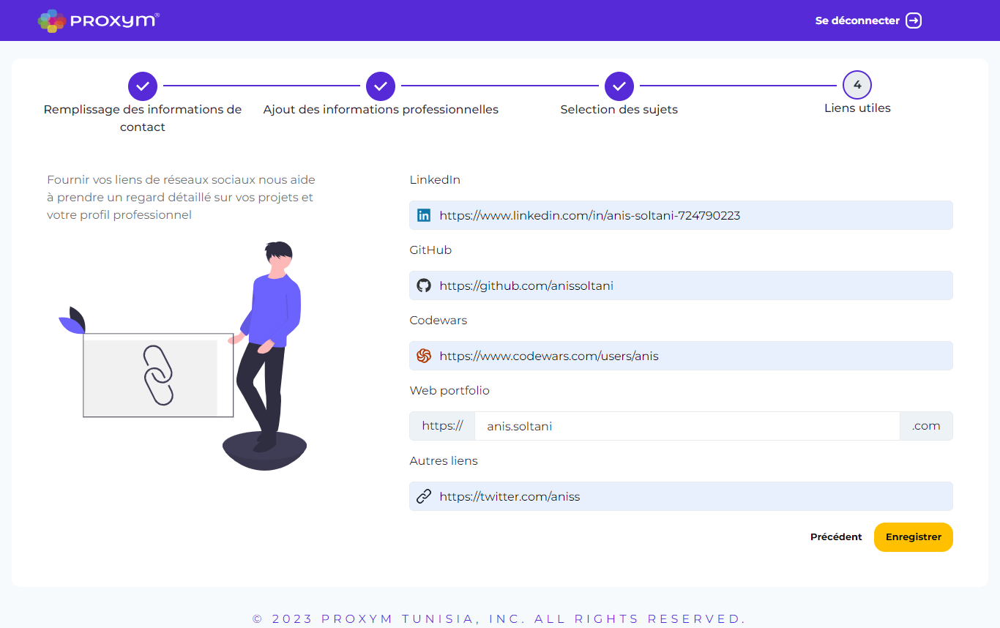
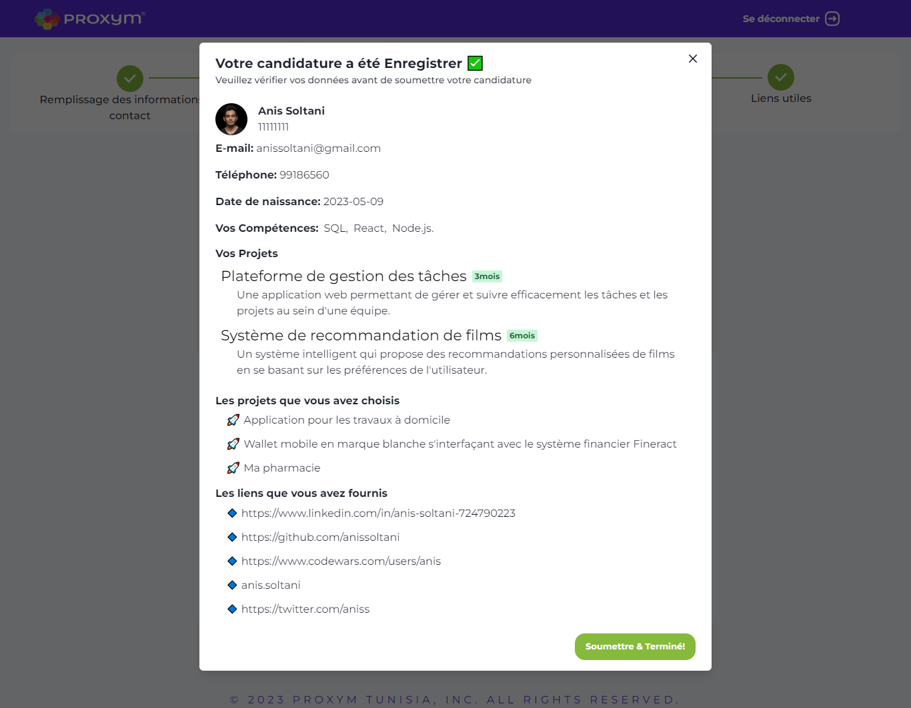

## Admin

### Admin Dashboard

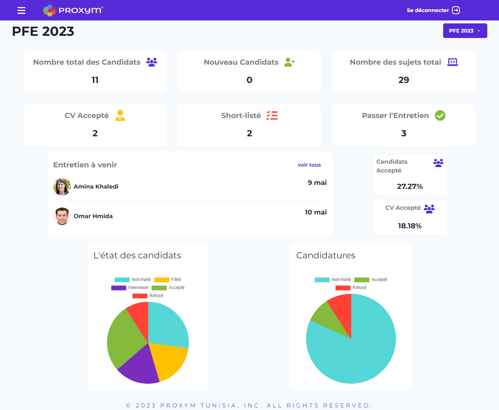

### Candidates interface

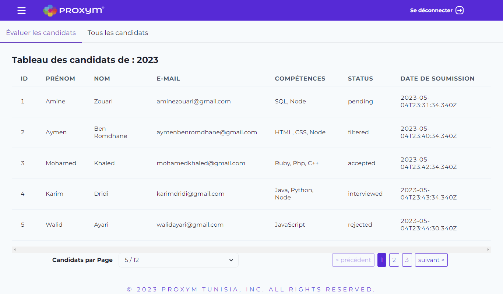

### Evaluate Candidate

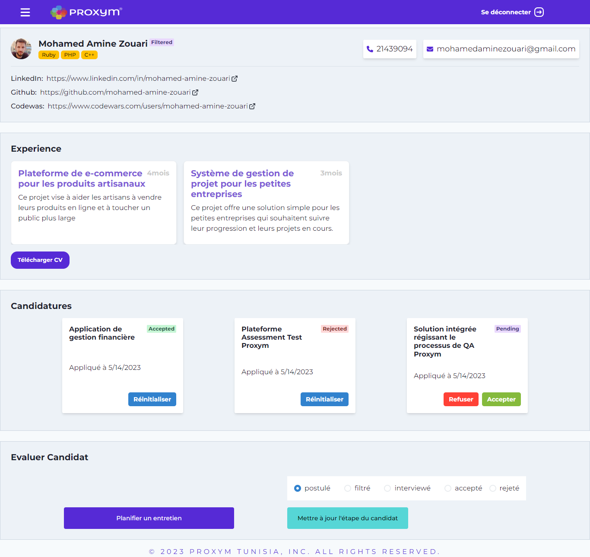

### Sessions interface

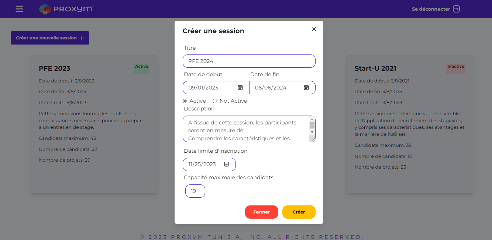

### Projects interface

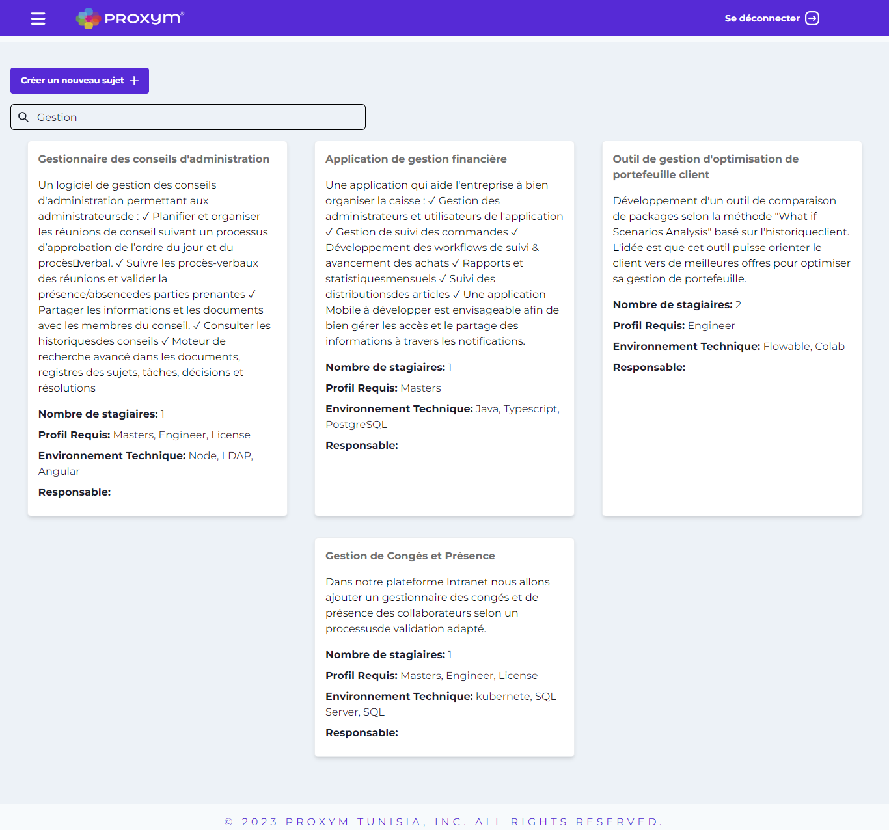
